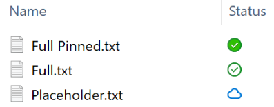

# Regression Testing

Use this in the release ticket:

```md
- [ ] 1. Install, Setup and Configuration
  - [ ] Linux
  - [ ] Windows
- [ ] 2. Folders
  - [ ] Linux
  - [ ] Windows
- [ ] 3. Files
  - [ ] Linux
  - [ ] Windows
- [ ] 4. Move Files and Folders
  - [ ] Linux
  - [ ] Windows
- [ ] 5. Edit Files
  - [ ] Linux
  - [ ] Windows
- [ ] 6. Delete Files and Folders
  - [ ] Linux
  - [ ] Windows
- [ ] 7. Sync process
  - [ ] Linux
  - [ ] Windows
- [ ] 8. Spaces and Sharing
  - [ ] Linux
  - [ ] Windows
- [ ] 9. Pause and Resume Sync
  - [ ] Linux
  - [ ] Windows
- [ ] 10. Advanced Configuration
  - [ ] Linux
  - [ ] Windows
- [ ] 11. Selective Sync
  - [ ] Linux
- [ ] 12. VFS
  - [ ] Windows
```

## Preparation and Instructions

1. Run the current latest OpenCloud Server.
2. Other than install test suite, enable logging including HTTP traffic (`Settings` -> `Log Settings`) in the client.

- 💡: Test cases that are automated are marked with 🤖 and can be skipped from testing manually.

## Test Suites

### 1. Install, Setup and Configuration

> [!IMPORTANT]
>
> Run this test suite with:
>
> - [ ] Builtin IDP ([Lico](https://github.com/libregraph/lico))
> - [ ] Keycloak: To run OpenCloud with Keycloak setup, use the [deployment examples](https://github.com/opencloud-eu/opencloud-compose/blob/main/README.md#with-keycloak-and-ldap-using-a-shared-user-directory).

| ID  | Test Case                                                     | Test Step                                                                                                                                                                                                                                                                                                                                                                                                                            | Expected Result                                                                                  | Result                         | Automated Test Suite      |
| --- | ------------------------------------------------------------- | ------------------------------------------------------------------------------------------------------------------------------------------------------------------------------------------------------------------------------------------------------------------------------------------------------------------------------------------------------------------------------------------------------------------------------------ | ------------------------------------------------------------------------------------------------ | ------------------------------ | ------------------------- |
| 1   | Update Installation                                           | 1. Install a previous version<br>2. Update to the new version                                                                                                                                                                                                                                                                                                                                                                        |                                                                                                  | 🚧 Win<br>🚧 macOS<br>🚧 Linux |                           |
| 2   | Install the new version                                       | Delete any previous version<br><br> **Windows:** <br> - Install the desktop client using .exe installer.<br><br> **Mac:** <br> - Install the desktop client using .pkg installer <br><br> **Ubuntu or Debian with GNOME desktop:** <br> - Run the client as AppImage. <br><br> **Fedora with GNOME desktop:** <br> - Run the client as AppImage. <br><br> **All platforms:** <br> - Check the version from the Settings tab -> About | installed version is correct                                                                     | 🚧 Win<br>🚧 macOS<br>🚧 Linux |                           |
| 3   | Verify that you can enter a server address (self signed cert) | 1. Launch desktop client<br>2. Enter a server address<br>3. Click on Next<br>4. If it is the first time you should accept the certificate                                                                                                                                                                                                                                                                                            |                                                                                                  | 🤖 Win<br>🚧 macOS<br>🤖 Linux | add-account               |
| 4   | Valid Login                                                   | 1. Log in with the correct username and password                                                                                                                                                                                                                                                                                                                                                                                     | Login successful                                                                                 | 🤖 Win<br>🚧 macOS<br>🤖 Linux | add-account               |
| 5   | Invalid Login                                                 | 1. Try to log in with wrong username or password                                                                                                                                                                                                                                                                                                                                                                                     | Error message `Logon failed. Please verify your credentials and try again.` is shown             | 🚧 Win<br>🚧 macOS<br>🚧 Linux |                           |
| 6   | Skip sync folder                                              | Skip sync folder configuration during setup                                                                                                                                                                                                                                                                                                                                                                                          | Setup is completed, no folder is synced, but can be added later                                  | 🤖 Win<br>🚧 macOS<br>🤖 Linux | sync-resources            |
| 7   | Configure sync folder                                         | Configure sync folder configuration during setup                                                                                                                                                                                                                                                                                                                                                                                     | Setup is completed, folder is synced                                                             | 🤖 Win<br>🚧 macOS<br>🤖 Linux | add-account               |
| 8   | Remove an account                                             | 1. Add an account to desktop client<br>2. Upload files and folders via WebUI<br>3. Wait for sync to complete<br>4. Remove the account                                                                                                                                                                                                                                                                                                | The account is removed from the Desktop client but the files and folder exist on the file system | 🤖 Win<br>🚧 macOS<br>🤖 Linux | remove-account-connection |
| 9   | re-add an account                                             | 1. Add an account to desktop client<br>2. Upload files and folders via WebUI<br>3. Wait for sync to complete<br>4. Remove the account<br>5. Add the same account again                                                                                                                                                                                                                                                               | The account is added, all files and folder are synced                                            | 🤖 Win<br>🚧 macOS<br>🤖 Linux | add-account               |

### 2. Folders

- 'Go to local sync folder and create a folder' means: "Open folder" on client dot ... menu, create a new folder in file browser
- 'Verify on the server' means: the folder is sent from client to server / check either with web browser or another client

| ID  | Test Case                                                 | Test Step                                                                                                                                                                                                                                                                                                                                                                                                | Expected Result                                                                                                                                                                                 | Result                         | Automated Test Suite |
| --- | --------------------------------------------------------- | -------------------------------------------------------------------------------------------------------------------------------------------------------------------------------------------------------------------------------------------------------------------------------------------------------------------------------------------------------------------------------------------------------- | ----------------------------------------------------------------------------------------------------------------------------------------------------------------------------------------------- | ------------------------------ | -------------------- |
| 1   | create a folder                                           | 1. Add an account to desktop client<br>2. Open local sync folder<br>3. Create a folder<br>4. Wait for sync to complete                                                                                                                                                                                                                                                                                   | The folder is available on the server                                                                                                                                                           | 🤖 Win<br>🚧 macOS<br>🤖 Linux | sync-resources       |
| 2   | folder with long name                                     | 1. Create a folder with a long name (~100 characters)<br>2. Wait for sync to complete                                                                                                                                                                                                                                                                                                                    | The folder is available on the server                                                                                                                                                           | 🤖 Win<br>🚧 macOS<br>🤖 Linux | sync-resources       |
| 3   | folder with special characters                            | 1. Create a folder with special characters and emojis (e.g. `$%ñ&💥🫨❤️‍🔥`) in the local sync folder<br>2. Wait for sync to complete                                                                                                                                                                                                                                                                       | The folder is available on the server                                                                                                                                                           | 🤖 Win<br>🚧 macOS<br>🤖 Linux | sync-resources       |
| 4   | folder with many subfolders                               | 1. Inside the sync root, create a folder with 5 empty subfolders and 5 subfolders containing files<br>2. Wait for sync to complete                                                                                                                                                                                                                                                                       | All 10 subfolders are available on the server                                                                                                                                                   | 🤖 Win<br>🚧 macOS<br>🤖 Linux | sync-resources       |
| 5   | sync many folders at once                                 | 1. Create 400 folders outside the sync root<br>2. Move those folders into the sync root<br>3. Wait for sync to complete                                                                                                                                                                                                                                                                                  | All 400 folders are available on the server                                                                                                                                                     | 🚧 Win<br>🚧 macOS<br>🚧 Linux |                      |
| 6   | copy of a folder                                          | 1. Open local sync folder<br>2. Create a folder with some files in it<br>3. Copy and paste that folder<br>4. Wait for sync to complete<br>5. Check the folders and the content of file inside it                                                                                                                                                                                                         | Both original and copied folders are available and contains the file on the server                                                                                                              | 🤖 Win<br>🚧 macOS<br>🤖 Linux | sync-resources       |
| 7   | subfolder with long name                                  | 1. Open local sync folder<br>2. Create a folder<br>3. Create a subfolder with long name (~220 characters)<br>4. Wait for sync to complete                                                                                                                                                                                                                                                                | Folder and subfolder are available on the server                                                                                                                                                | 🤖 Win<br>🚧 macOS<br>🤖 Linux | sync-resources       |
| 8   | pre-existing folders                                      | 1. Quit the desktop client<br>2. Goto the local sync folder<br>3. Create folders at several levels<br>4. Open the desktop client<br>5. Wait for sync to complete                                                                                                                                                                                                                                         | All folders are available on the server                                                                                                                                                         | 🤖 Win<br>🚧 macOS<br>🤖 Linux | sync-resources       |
| 9   | .zip/.rar files with elaborate internal folder structures | 1. Create a zip file with many internal folders and files<br>2. Copy that zip file into the sync root<br>3. Unzip that zip file inside the sync root                                                                                                                                                                                                                                                     | All extracted files and folders are available on the server                                                                                                                                     | 🤖 Win<br>🚧 macOS<br>🤖 Linux | sync-resources       |
| 10  | Invalid system names                                      | 1. On the server, create folders `CON`, `COM1` and `test%` and files `PRN` and `foo%`<br>2. Add that account to the desktop client                                                                                                                                                                                                                                                                       | - MacOS client syncs down `CON`, `COM1` and `PRN` but not `test%` and `foo%`<br>- Windows client syncs down `test%` and `foo%` but not `CON`, `COM1` and `PRN`<br>- Linux client syncs down all | 🤖 Win<br>🚧 macOS<br>🤖 Linux | sync-resources       |
| 11  | Long path on Windows                                      | 1. Make sure LongPathsEnabled in Windows registry is 'off' (see https://docs.microsoft.com/en-us/windows/win32/fileio/maximum-file-path-limitation?tabs=cmd) <br>2. On the server, create a file (~30 chars) inside 6 subfolders (each ~50 chars) to get a path length > 260 chars (> MAX_PATH)<br>3. Start desktop client<br>4. Open local sync folder and enter the subfolders<br>5. Create a new file | 1. All subfolders and the file are available in the local sync folder<br>2. New file is synced to the server                                                                                    | 🚧 Win                         |                      |

### 3. Files

Note: "Via Web" means check files on server in the web browser

| ID  | Test Case                                                    | Test Step                                                                                                                                                                                                                                                                                    | Expected Result                                                                                                         | Result                         | Automated Test Suite |
| --- | ------------------------------------------------------------ | -------------------------------------------------------------------------------------------------------------------------------------------------------------------------------------------------------------------------------------------------------------------------------------------- | ----------------------------------------------------------------------------------------------------------------------- | ------------------------------ | -------------------- |
| 1   | create a file                                                | 1. Add an account to desktop client<br>2. Open local sync folder<br>3. Create a file                                                                                                                                                                                                         | - observe a BLUE progress icon followed by a GREEN icon in the file explorer<br>- the file is available on the server   | 🤖 Win<br>🚧 macOS<br>🤖 Linux | sync-resources       |
| 2   | Add various types of files                                   | 1. Open local sync folder<br>2. Create/upload various types of files `Microsoft Word`, `Microsoft Excel`, `Microsoft Powerpoint`, `JPG`, `PNG`, `JPEG`, `PDF`, `MP3`, `MP4`, etc                                                                                                             | - the Sync files tab shows all the files as synced<br>- all files are available on the server                           | 🤖 Win<br>🚧 macOS<br>🤖 Linux | sync-resources       |
| 3   | File with long name can be synced                            | 1. Open local sync folder<br>2. Create a file with long name: `thisIsAVeryLongFileNameToCheckThatItWorks-thisIsAVeryLongFileNameToCheckThatItWorks-thisIsAVeryLongFileNameToCheckThatItWorks-thisIsAVeryLongFileNameToCheckThatItWorks-thisIsAVeryLongFileNameToCheckThatItWorks-thisIs.txt` | Sync is successful                                                                                                      | 🤖 Win<br>🚧 macOS<br>🤖 Linux | sync-resources       |
| 4   | copy/drag&drops multiple files at a time                     | 1. Copy some files to the local sync folder<br>2. Drag&Drop some files to the local sync folder                                                                                                                                                                                              | - user can see the completed GREEN icon overlay on all types of files<br>- the Sync files tab shows all files as synced | 🚧 Win<br>🚧 macOS<br>🚧 Linux |                      |
| 5   | Sync files (from server and desktop client) at the same time | 1. Add a (big) file inside of the local sync folder, and in the same time, upload another file through the webUI in the same folder (make sure that both files are uploaded at the same time)                                                                                                | Both files are synced correctly. Check via Web UI and the Desktop Client                                                | 🚧 Win<br>🚧 macOS<br>🚧 Linux |                      |
| 6   | Same name files but with different extensions                | 1. Open local sync folder<br>2. Create two files with same name but different extensions                                                                                                                                                                                                     | Both files sync correctly                                                                                               | 🤖 Win<br>🚧 macOS<br>🤖 Linux | sync-resources       |
| 7   | File with spaces in the name                                 | 1. Open local sync folder<br>2. Create, copy or move a file (having space in its name) in the local sync folder                                                                                                                                                                              | File syncs correctly                                                                                                    | 🤖 Win<br>🚧 macOS<br>🤖 Linux | sync-resources       |
| 8   | Create and delete a file with special characters in the name | 1. Open local sync folder<br>2. Create/upload a file with special characters in its name (e.g. **~`!@#$^&()-_=+{[}];',$%ñ&💥🫨❤️‍🔥**)<br>3. Wait for sync to complete<br>4. Delete the file from the local sync folder                                                                         | Look via the Web and make sure that the file got deleted                                                                | 🚧 Win<br>🚧 macOS<br>🤖 Linux | delete-files-folders |
| 9   | Upload a 50MB file                                           | 1. Create a folder inside the local sync folder<br>2. Copy a large file (50MB) in this folder                                                                                                                                                                                                | The file is synced to the server                                                                                        | 🚧 Win<br>🚧 macOS<br>🤖 Linux |                      |
| 10  | Upload a 3GB file                                            | 1. On the server, upload a large 3GB file<br>2. Add that account to desktop client                                                                                                                                                                                                           | File is synced to the desktop client                                                                                    | 🚧 Win<br>🚧 macOS<br>🚧 Linux |                      |
| 11  | Upload multiple files (with a sum of 1000MB)                 | 1. Open local sync folder<br>2. Upload a folder containing 1000 files (1MB each)                                                                                                                                                                                                             | All files are synced to the server                                                                                      | 🚧 Win<br>🚧 macOS<br>🤖 Linux | sync-resources       |
| 12  | Upload 500MB + 500MB files                                   | 1. Open temp folder<br>2. Create two folders containing 500 files each(1MB per file)<br>3. Move those folders from temp folder to sync folder<br>4. Wait for folders to be synced                                                                                                            | All folders and files are synced to the server                                                                          | 🤖 Win<br>🚧 macOS<br>🤖 Linux | sync-resources       |
| 13  | Upload a 1024MB file                                         | 1. Open local sync folder<br>2. Upload a 1GB file                                                                                                                                                                                                                                            | The file is synced to the server                                                                                        | 🤖 Win<br>🚧 macOS<br>🤖 Linux | sync-resources       |
| 14  | quota limit                                                  | 1. Open local sync folder<br>2. Upload the necessary large files to fill up the quota                                                                                                                                                                                                        | Warning: "Space quota exceeded. Please contact the Administrator of this space."                                        | 🚧 Win<br>🚧 macOS<br>🚧 Linux |                      |

### 4. Move Files and Folders

| ID  | Test Case                                             | Test Step                                                                                                                                                    | Expected Result                                                      | Result                         | Automated Test Suite |
| --- | ----------------------------------------------------- | ------------------------------------------------------------------------------------------------------------------------------------------------------------ | -------------------------------------------------------------------- | ------------------------------ | -------------------- |
| 1   | Move from sub-levels to root                          | 1. Move couple of files and folders from different sub-levels to the sync root<br>2. Wait for sync to complete<br>3. Check the contents of files and folders | The contents are correct (on the server)                             | 🚧 Win<br>🚧 macOS<br>🤖 Linux | move-files-folders   |
| 2   | Move a folder and file down to sub-folder             | 1. Move a folder and file from sync root to a 5 level deep sub-folder<br>2. Wait for sync to complete<br>3. Check the content of file and folder exist       | The content of the file is correct and folder exists (on the server) | 🤖 Win<br>🚧 macOS<br>🤖 Linux | move-files-folders   |
| 3   | Move a folder and file up from sub-folder to the root | 1. Move a folder and file from a 5 level deep folder to the sync root<br>2. Wait for sync to complete<br>3. Check the content of file and folder exist       | The content of the file is correct and folder exists (on the server) | 🤖 Win<br>🚧 macOS<br>🤖 Linux | move-files-folders   |
| 4   | Move files from one folder to another                 | 1. Move some files from `Folder1` to `Folder2`<br>2. Wait for sync to complete<br>3. Check both folders contents                                             | Both folders have the correct content (on the server)                | 🤖 Win<br>🚧 macOS<br>🤖 Linux | move-files-folders   |

### 5. Edit Files

| ID  | Test Case                               | Test Step                                                                                                                                                                                                                                                                                        | Expected Result                                                         | Result                         | Automated Test Suite |
| --- | --------------------------------------- | ------------------------------------------------------------------------------------------------------------------------------------------------------------------------------------------------------------------------------------------------------------------------------------------------ | ----------------------------------------------------------------------- | ------------------------------ | -------------------- |
| 1   | Edit a .txt file                        | 1. Create a .txt file in the local sync folder<br>2. Add some text<br>3. Wait for it to sync<br>4. Modify the .txt file and add more content<br>5. Wait for it to sync                                                                                                                           | The file at the server had the same content after the sync is completed | 🤖 Win<br>🚧 macOS<br>🤖 Linux | edit-files           |
| 2   | Edit a .docx file                       | 1. Create a .docx file in the local sync folder<br>2. Add some text<br>3. Wait for it to sync<br>4. Modify the .docx file and add more content<br>5. Wait for it to sync<br>6. Modify the .docx file and add more content<br>7. Wait for it to sync                                              | The file at the server had the same content after the sync is completed | 🤖 Win<br>🚧 macOS<br>🤖 Linux | edit-files           |
| 3   | Edit a .xlsx file                       | 1. Create a .xlsx file in the local sync folder<br>2. Add some text<br>3. Wait for it to sync<br>4. Modify the .xlsx file and add more content<br>5. Wait for it to sync<br>6. Modify the .xlsx file and add more content<br>7. Wait for it to sync                                              | The file at the server had the same content after the sync is completed | 🤖 Win<br>🚧 macOS<br>🤖 Linux | edit-files           |
| 4   | Replace a .pdf file                     | 1. Create a .pdf file in the local sync folder<br>2. Replace it with a same name pdf file having different content<br>3. Wait for it to sync<br>4. Modify the .pdf file and add more content<br>5. Wait for it to sync<br>6. Modify the .pdf file and add more content<br>7. Wait for it to sync | The file at the server had the same content after the sync is completed | 🤖 Win<br>🚧 macOS<br>🤖 Linux | edit-files           |
| 5   | Edit a file while the folder is renamed | 1. Add an account to desktop client that has a folder containing a file in it<br>2. From the file explorer, open that file and edit it<br>3. From the web, rename the folder<br>4. Sync with the oc-worker<br>5. Do not refresh the browser and download the file edited                         | The file on the server has the same content                             | 🚧 Win<br>🚧 macOS<br>🚧 Linux |                      |
| 6   | Rename file and folder at the same time | 1. Add an account to desktop client that has a folder containing a file in it<br>2. From the web, rename that folder and at the same time from the file explorer, rename a file contained in that folder                                                                                         | File and folder should be renamed both in the server and locally        | 🚧 Win<br>🚧 macOS<br>🚧 Linux |                      |

### 6. Delete Files and Folders

| ID  | Test Case                      | Test Step                                                                                                                                               | Expected Result                     | Result                         | Automated Test Suite                                                |
| --- | ------------------------------ | ------------------------------------------------------------------------------------------------------------------------------------------------------- | ----------------------------------- | ------------------------------ | ------------------------------------------------------------------- |
| 1   | Delete a file                  | 1. On the server, create a file<br>2. Add that account to the desktop client<br>3. Open the local sync folder<br>4. Delete that file                    | The file is deleted on the server   | 🤖 Win<br>🚧 macOS<br>🤖 Linux | delete-files-folders                                                |
| 2   | Delete a file with long name   | 1. On the server, create a file with long name<br>2. Add that account to the desktop client<br>3. Open the local sync folder<br>4. Delete that file     | The file is deleted on the server   | 🤖 Win<br>🚧 macOS<br>🤖 Linux | delete-files-folders (Maximum length of filename is 228 chraracter) |
| 3   | Delete a folder                | 1. On the server, create a folder<br>2. Add that account to the desktop client<br>3. Open the local sync folder<br>4. Delete that folder                | The folder is deleted on the server | 🤖 Win<br>🚧 macOS<br>🤖 Linux | delete-files-folders                                                |
| 4   | Delete a folder with long name | 1. On the server, create a folder with long name<br>2. Add that account to the desktop client<br>3. Open the local sync folder<br>4. Delete that folder | The folder is deleted on the server | 🤖 Win<br>🚧 macOS<br>🤖 Linux | delete-files-folders                                                |
| 5   | Delete multiple files          | 1. On the server, create some files<br>2. Add that account to the desktop client<br>3. Open the local sync folder<br>4. Delete some files               | The files get deleted on the server | 🤖 Win<br>🚧 macOS<br>🤖 Linux | delete-files-folders                                                |
| 6   | Delete a large file (2048MB)   | 1. On the server, create a large file (2048MB)<br>2. Add that account to the desktop client<br>3. Open the local sync folder<br>4. Delete that file     | The file gets deleted on the server | 🚧 Win<br>🚧 macOS<br>🚧 Linux |                                                                     |

### 7. Sync Process

| ID  | Test Case                                  | Test Step                                                                                                                                                                                                                       | Expected Result                                                                                | Result                         | Automated Test Suite |
| --- | ------------------------------------------ | ------------------------------------------------------------------------------------------------------------------------------------------------------------------------------------------------------------------------------- | ---------------------------------------------------------------------------------------------- | ------------------------------ | -------------------- |
| 1   | Move a file while in sync                  | 1. Move couple of files (`File1` and `File2`) with different contents to the root sync folder<br>2. Let them sync<br>3. Move other files to the root sync folder and while in sync, delete `File1` and rename `File2` to`File1` | The content of file is correct                                                                 | 🚧 Win<br>🚧 macOS<br>🚧 Linux |                      |
| 2   | Edit a file while in sync                  | 1. Create a .txt file with some content<br>2. Let it sync<br>3. Rename the file and while in sync, edit the content of the .txt file                                                                                            | The content of file is correct                                                                 | 🚧 Win<br>🚧 macOS<br>🚧 Linux |                      |
| 3   | Delete folders while in sync               | 1. Create folders tree folders+subfolders (e.g folder1, folder2, folder3 and some .txt files in this folder)<br>2. Delete some folders while in sync                                                                            | Folders get deleted on the server                                                              | 🚧 Win<br>🚧 macOS<br>🚧 Linux |                      |
| 4   | Delete folders while sync with two clients | 1. Create a tree of folders+subfolders (e.g folder1, folder2, folder3 and some .txt files in this folder)<br>2. Delete some folders and while in sync, sync with another client at the same time                                | On the server, make sure that the folders got deleted and the remaining folders sync correctly | 🚧 Win<br>🚧 macOS<br>🚧 Linux |                      |

### 8. Spaces and Sharing

| ID  | Test Case                                        | Test Step                                                                                                                                                                                                                                                                                                                                                                                                                                                                     | Expected Result                                                                                                           | Result                         | Automated Test Suite |
| --- | ------------------------------------------------ | ----------------------------------------------------------------------------------------------------------------------------------------------------------------------------------------------------------------------------------------------------------------------------------------------------------------------------------------------------------------------------------------------------------------------------------------------------------------------------- | ------------------------------------------------------------------------------------------------------------------------- | ------------------------------ | -------------------- |
| 1   | Viewer can view files in Space                   | 1. On the server, create a space, upload a file in it and add a user with Viewer role<br>2. As a space member (Viewer), add that space to the desktop client<br>3. Open the local sync folder and open that file                                                                                                                                                                                                                                                              | The file can be opened                                                                                                    | 🤖 Win<br>🚧 macOS<br>🤖 Linux | spaces               |
| 2   | Viewer cannot edit files in Space                | 1. On the server, create a space, upload a file in it and add a user with Viewer role<br>2. As a space member (Viewer), add that space to the desktop client<br>3. Open the local sync folder<br>4. Edit that file and save it                                                                                                                                                                                                                                                | Changes are not synced. Locally a conflicted copy is created                                                              | 🤖 Win<br>🚧 macOS<br>🤖 Linux | spaces               |
| 3   | Editor can rename files in Space                 | 1. On the server, create a space, upload a file in it and add a user with Editor role<br>2. As a space member (Editor), add that space to the desktop client<br>3. Open the local sync folder<br>4. Rename that file                                                                                                                                                                                                                                                          | The files is renamed and synced                                                                                           | 🤖 Win<br>🚧 macOS<br>🤖 Linux | spaces               |
| 4   | Manager can add new folders in Space             | 1. On the server, create a space, upload a file in it and add a user with Manager role<br>2. As a space member (Manager), add that space to the desktop client<br>3. Open the local sync folder<br>4. Create a new folder                                                                                                                                                                                                                                                     | New folder is synced                                                                                                      | 🤖 Win<br>🚧 macOS<br>🤖 Linux | spaces               |
| 5   | Remove a project space sync connection           | 1. On the server, create a space, upload a file in it and add a user with Manager role<br>2. As a space member (Manager), add that space to the desktop client<br>3. Wait till all files and folder are synced<br>4. Remove the space from the desktop client                                                                                                                                                                                                                 | Space is deleted from the list, all files and folders still exist in the local sync folder                                | 🤖 Win<br>🚧 macOS<br>🤖 Linux | spaces               |
| 6   | sync a received shared folder `can view(secure)` | 1. On the server, create a folder<br>2. upload some files into it<br>3. Share the folder with an other user with `can view(secure)` permissions<br>4. As the share receiver, add the "Shares" space to the desktop client<br>5. create folders locally in the received share<br>6. copy files into the received local folder                                                                                                                                                  | Folder is shown, but no files are synced in ether direction, error message shown by the client                            | 🚧 Win<br>🚧 macOS<br>🚧 Linux |                      |
| 7   | sync a received shared folder `can view`         | 1. On the server, create a folder<br>2. upload some files into it<br>3. Share the folder with an other user with `can view` permissions<br>4. As the share receiver, add the "Shares" space to the desktop client<br>5. create folders locally in the received share<br>6. copy files into the received local folder                                                                                                                                                          | Folder and files are downloaded, but no folder/files are uploaded to the server, error message shown by the client        | 🤖 Win<br>🚧 macOS<br>🤖 Linux | spaces               |
| 8   | sync a received shared folder `can upload`       | 1. On the server, create a folder<br>2. upload some files into it<br>3. Share the folder with an other user with `can upload` permissions<br>4. As the share receiver, add the "Shares" space to the desktop client<br>5. create folders locally in the received share<br>6. copy files into the received local folder<br>7. edit a local file                                                                                                                                | Folder and files are synced in both directions, but editing results in a new conflict file and the change is not uploaded | 🚧 Win<br>🚧 macOS<br>🚧 Linux |                      |
| 9   | sync a received shared folder `can edit`         | 1. On the server, create a folder<br>2. upload some files into it<br>3. Share the folder with an other user with `can edit` permissions<br>4. As the share receiver, add the "Shares" space to the desktop client<br>5. create folders locally in the received share<br>6. copy files into the received local folder<br>7. edit a local file                                                                                                                                  | Folder and files are synced in both directions                                                                            | 🚧 Win<br>🚧 macOS<br>🤖 Linux | spaces               |
| 10  | remove a share                                   | 1. On the server, create a folder<br>2. upload some files into it<br>3. Share the folder with an other user with `can edit` permissions<br>4. As the share receiver, add the "Shares" space to the desktop client<br>5. wait till the folder is synced locally<br>6. Delete the share on the server                                                                                                                                                                           | Folder and files disappear from the local sync folder                                                                     | 🚧 Win<br>🚧 macOS<br>🤖 Linux |                      |
| 11  | remove a share while offline                     | 1. On the server, create a folder<br>2. upload some files into it<br>3. Share the folder with an other user with `can edit` permissions<br>4. As the share receiver, add the "Shares" space to the desktop client<br>5. wait till the folder is synced locally<br>6. Disconnect from the server e.g. by disconnecting from the internet<br>7. Add a new file to the shared folder locally<br>8. Delete the share on the server<br>9. reestablish the connection to the server | 404 transferring error                                                                                                    | 🚧 Win<br>🚧 macOS<br>🚧 Linux |                      |
| 12  | Viewer creates folder in a project space         | 1. On the server, create a project space<br>2. Add an user in that space with `Can view` permission role.<br>3. As a space member (Viewer), add that space to the desktop client<br>4. Open the local sync folder and create a folder                                                                                                                                                                                                                                         | Folder is blacklisted                                                                                                     | 🚧 Win<br>🚧 macOS<br>🤖 Linux |                      |

### 9. Pause and Resume Sync

| ID  | Test Case                                                     | Test Step                                                                                                                                                                                                                                                                                                                                                           | Expected Result                                                            | Result                         | Automated Test Suite |
| --- | ------------------------------------------------------------- | ------------------------------------------------------------------------------------------------------------------------------------------------------------------------------------------------------------------------------------------------------------------------------------------------------------------------------------------------------------------- | -------------------------------------------------------------------------- | ------------------------------ | -------------------- |
| 1   | Sync after reestablishing the connection                      | 1. Add an account to the desktop client<br>2. Disconnect from the server e.g. by disconnecting from the internet<br>3. Copy several files and folders into the sync folder<br>4. reestablish the connection to the server<br>5. Wait for sync                                                                                                                       | The files and folder are synced to the server                              | 🚧 Win<br>🚧 macOS<br>🚧 Linux |                      |
| 2   | Merge folder content after reestablishing the connection      | 1. Add an account to the desktop client<br>2. Disconnect from the server e.g. by disconnecting from the internet<br>3. Upload a folder with some files to the server e.g. by the webUI or an other client<br>4. In the local sync folder, create a folder with the same name but different files<br>5. reestablish the connection to the server<br>6. Wait for sync | All files and folder are synced to the server and to the local sync folder | 🚧 Win<br>🚧 macOS<br>🚧 Linux |                      |
| 3   | Deletion after reestablishing the connection                  | 1. Add an account to the desktop client<br>2. Disconnect from the server e.g. by disconnecting from the internet<br>3. Delete a folder from the local sync folder<br>4. Connect the Internet<br>5. Wait for sync                                                                                                                                                    | The folder is deleted from the server                                      | 🚧 Win<br>🚧 macOS<br>🚧 Linux |                      |
| 4   | manually pause/resume a sync                                  | 1. Add an account to the desktop client<br>2. Upload big files to the server into a project space & personal space via WebUI<br>3. Copy other big files into the local sync folder of the project space & personal space<br>4. Pause the sync while files are uploaded/downloaded<br>5. Resume the sync.                                                            | All files are folders are synced correctly in both directions              | 🚧 Win<br>🚧 macOS<br>🚧 Linux |                      |
| 5   | Force a sync while an Upload to a different space is running  | 1. Add an account to the desktop client<br>2. Copy small files into the local sync folder of a project space<br>3. Copy big files into the local sync folder of the personal space<br>4. Wait till the project space sync is finished and personal space sync still runs<br>5. Force a sync of the project space.                                                   | All files are folders are synced correctly in both directions              | 🚧 Win<br>🚧 macOS<br>🚧 Linux |                      |
| 6   | Force a sync while Download from a different space is running | 1. Add an account to the desktop client<br>2. Upload small files into a project space using the webUI<br>3. Upload big files into a personal space using the webUI<br>4. Wait till the project space sync is finished and personal space sync still runs<br>5. Force a sync of the project space.                                                                   | All files are folders are synced correctly in both directions              | 🚧 Win<br>🚧 macOS<br>🚧 Linux |                      |
| 7   | Conflicting file                                              | 1. Add an account to the desktop client<br>2. save a file in the local sync folder<br>3. Disconnect from the server e.g. by disconnecting from the internet<br>4. Edit the same file locally and on the server<br>4. reestablish the connection to the server<br>5. Wait for sync                                                                                   | Conflict file are created locally and on the server                        | 🤖 Win<br>🚧 macOS<br>🤖 Linux | sync-resources       |

### 10. Advanced Configuration

| ID  | Test Case                                   | Test Step                                                                                                                                                                                                                       | Expected Result                                                                                   | Result                         | Automated Test Suite |
| --- | ------------------------------------------- | ------------------------------------------------------------------------------------------------------------------------------------------------------------------------------------------------------------------------------- | ------------------------------------------------------------------------------------------------- | ------------------------------ | -------------------- |
| 1   | Advanced configuration                      | 1. Start the desktop client and fill in the server details<br>2. Check the advanced configuration checkbox                                                                                                                      | `Download everything` option is selected                                                          | 🤖 Win<br>🚧 macOS<br>🤖 Linux | add-account          |
| 2   | Configure synchronization manually          | 1. Start the desktop client and fill in the server details<br>2. Check the advanced configuration checkbox<br>3. choose `Configure synchronization manually`<br>4. Connect the account<br>5. Choose a space and a local folder  | The space is synced into the chosen folder                                                        | 🤖 Win<br>🚧 macOS<br>🤖 Linux | add-account          |
| 3   | Configure synchronization manually, a space | 1. Start the desktop client and fill in the server details<br>2. Check the advanced configuration checkbox<br>3. choose `Configure synchronization manually`<br>4. Connect the account<br>5. Choose "Cancel" in the next screen | - No local sync folder is created<br>- The setting window is opened and the account is registered | 🤖 Win<br>🚧 macOS<br>🤖 Linux | sync-resources       |

### 11. Selective Sync

> [!NOTE]
> Selective sync is not available on Windows due to VFS implemented by default.

| ID  | Test Case                                | Test Step                                                                                                                                                                                                                                                                                                           | Expected Result                                                                                    | Result               | Automated Test Suite |
| --- | ---------------------------------------- | ------------------------------------------------------------------------------------------------------------------------------------------------------------------------------------------------------------------------------------------------------------------------------------------------------------------- | -------------------------------------------------------------------------------------------------- | -------------------- | -------------------- |
| 1   | sync only one folder                     | 1. Upload some files and folders to the server<br>2. add an account to the desktop client with manual sync configuration<br>3. Choose the personal space to be synced<br>4. choose a local folder<br>5. Select only one folder to be synced and add the connection                                                  | Only one folder is synced                                                                          | 🚧 macOS<br>🤖 Linux | sync-resources       |
| 2   | unselected subfolders                    | 1. Upload a folder that has many subfolders to the server<br>2. Connect the desktop client and sync the personal space<br>From the `...` button for the space select "Chose what to sync" window, select the folder that has many subfolders<br>3. Extend that folder and unselect some subfolders<br>3. Click "OK" | The parent folder is synced but not the unselected subfolders                                      | 🚧 macOS<br>🤖 Linux | sync-resources       |
| 3   | Folder without subfolder in the list     | 1. From the `Deselect remote folders...` window, click on the `>` for a folder that does not have subfolders                                                                                                                                                                                                        | the `>` disappears                                                                                 | 🚧 macOS<br>🚧 Linux |                      |
| 4   | sync files both ways for selected folder | 1. From the `Deselect remote folders...` window, select a folder to sync and add the connection<br>2. Upload some files via webUI into that folder<br>3. Copy some other files into the corresponding local folder<br>4. Wait for sync                                                                              | Files are synced both ways                                                                         | 🚧 macOS<br>🚧 Linux |                      |
| 5   | sync files for unselected folder         | 1. From the `Deselect remote folders...` window, unselect a folder and add connection<br>2. From the server, upload some files in that unselected folder                                                                                                                                                            | The folder and files are not available in the sync folder<br>Previously synced folders are deleted | 🚧 macOS<br>🤖 Linux | sync-resources       |
| 6   | sync of files in root folder             | 1. From the `Deselect remote folders...` window, unselect all the folders<br>2. Add the connection                                                                                                                                                                                                                  | files that are in the root folder are synced                                                       | 🚧 macOS<br>🚧 Linux |                      |
| 7   | sorting of folders                       | 1. In the `Deselect remote folders...` window, sort the folders by name and size                                                                                                                                                                                                                                    | Sorting works                                                                                      | 🚧 macOS<br>🤖 Linux | sync-resources       |

### 12. VFS

> [!NOTE]
> **Always keep on this device (Hydrated)** = you’ve pinned the file locally including the data, so it stays on your device at all times and won’t be evicted automatically. <br>
> **Available on this device (Hydrated)** = the file data is locally present, but may be removed automatically to free up space. <br>
> **Available Online Only (Dehydrated)** = the file appears locally but only as a placeholder, actual data isn’t downloaded until accessed. <br>
> The following image demonstrates how the full pinned, full and placeholder file states are shown in File Explorer:
>
> ```
> 1. Full Pinned.txt = Always keep on this device (Hydrated)
> 2. Full.txt = Available on this device (Hydrated)
> 3. Placeholder.txt = Available online only (Dehydrated)
> ```
>
> 

| ID  | Test Case                                                       | Test Step                                                                                                                                                                                                                                                                                                                                                                                                                              | Expected Result                                                                                                                                                                                                                                                                                                                                                                                                                                  | Result | Automated Test Suite |
| --- | --------------------------------------------------------------- | -------------------------------------------------------------------------------------------------------------------------------------------------------------------------------------------------------------------------------------------------------------------------------------------------------------------------------------------------------------------------------------------------------------------------------------- | ------------------------------------------------------------------------------------------------------------------------------------------------------------------------------------------------------------------------------------------------------------------------------------------------------------------------------------------------------------------------------------------------------------------------------------------------ | ------ | -------------------- |
| 1   | Add account and connect to server                               | 1. Create two files with some content inside a folder in the server <br>2. Add an account to the desktop client <br>3. Open local sync folder and check status of all resources (2 files and their parent folder)                                                                                                                                                                                                                      | All resources (2 files and their parent folder) are virtual (Status: dehydrated)                                                                                                                                                                                                                                                                                                                                                                 | 🚧 Win |                      |
| 2   | Open a file                                                     | 1. Create a file with some content in the server <br>2. Add an account to the desktop client <br>3. Open local sync folder and open that file <br>4. Create a new file locally in the local sync folder, edit, save and exit it                                                                                                                                                                                                        | Both files are physically available (Status: hydrated)                                                                                                                                                                                                                                                                                                                                                                                           | 🚧 Win |                      |
| 3   | Free up space                                                   | 1. Create several new files in a new folder inside local sync folder <br>2. Right click on local folder, click on `Free up space`                                                                                                                                                                                                                                                                                                      | Folder along with files are dehydrated. Icon changed to cloud                                                                                                                                                                                                                                                                                                                                                                                    | 🚧 Win |                      |
| 4   | Always keep                                                     | 1. Create a file with content inside a local sync folder <br>2. Right click on that file and click on "Always keep on this device"                                                                                                                                                                                                                                                                                                     | File is physically available, same as `Always keep on this device`                                                                                                                                                                                                                                                                                                                                                                               | 🚧 Win |                      |
| 5   | Locked file                                                     | 1. Create a file with content inside a local sync folder <br>Open it in LibreOffice(LO)(Opening a resource in LO makes it locked), edit and save but don't exit <br>2. 'Free up space' in Explorer on the locked file &rarr; no error message, client shows "i" (Status: spinning icon), Activity tells that file is in use <br>3. Exit libreoffice                                                                                    | File is dehydrated correctly (Status: placeholder) after few seconds                                                                                                                                                                                                                                                                                                                                                                             | 🚧 Win |                      |
| 6   | Move file and directory locally                                 | 1. Create a file and a directory (with some files) inside the local sync root (some hydrated, some dehydrated) <br>2. Move (Cut + Paste) the file and the directory to a different folder inside the sync root                                                                                                                                                                                                                         | Both hydrated and dehydrated items are moved accordingly on the server (i.e., the same structure appears on the server)                                                                                                                                                                                                                                                                                                                          | 🚧 Win |                      |
| 7   | Move file and directory outside sync root                       | 1. Create a folder inside the sync root (which may be hydrated or dehydrated) <br>2. Move this folder to a location outside the sync root                                                                                                                                                                                                                                                                                              | The folder is removed on the server as well and no residual placeholder remains locally                                                                                                                                                                                                                                                                                                                                                          | 🚧 Win |                      |
| 8   | Move file/directory on the server                               | 1. Within the server (via web UI) move a file and a directory (including some dehydrated files) from one location to another                                                                                                                                                                                                                                                                                                           | The local sync root reflects the move: both hydrated and dehydrated files show up in the new location and removed from the old location                                                                                                                                                                                                                                                                                                          | 🚧 Win |                      |
| 9   | Remove directory while the file is still open locally           | 1. Create a directory inside local sync folder; create a file inside and open it in LibreOffice (LO) (file locked) <br>2. On the server, delete/remove the directory <br>3. While LO is still open, edit and save the file <br>4. Close LO                                                                                                                                                                                             | After closing LO, the directory and file are recreated locally (and synced to server)                                                                                                                                                                                                                                                                                                                                                            | 🚧 Win |                      |
| 10  | File name clash due to same name (but different case) in folder | 1. On the server: create a folder **FolderA**.<br>2. Inside FolderA create two files with identical names (e.g., **NewFile** and **Newfile**) <br>3. On the client: monitor sync and observe warning message: “file name clash…” appears for some seconds.<br>4. In the local sync folder: open FolderA and check status of both files and the folder.<br>5. Move FolderA from the sync-root to another location outside the sync-root | The client first displays the “file name clash” warning and lists the clash in Activity tab under “Not synced”.<br>The folder FolderA and the file(s) show a placeholder/cloud icon status. <br>After moving FolderA outside the sync-root, the file that had previously been synced will be deleted locally and from the server, and the file that had not synced will now be synced and present inside FolderA both on the server and locally. | 🚧 Win |                      |
